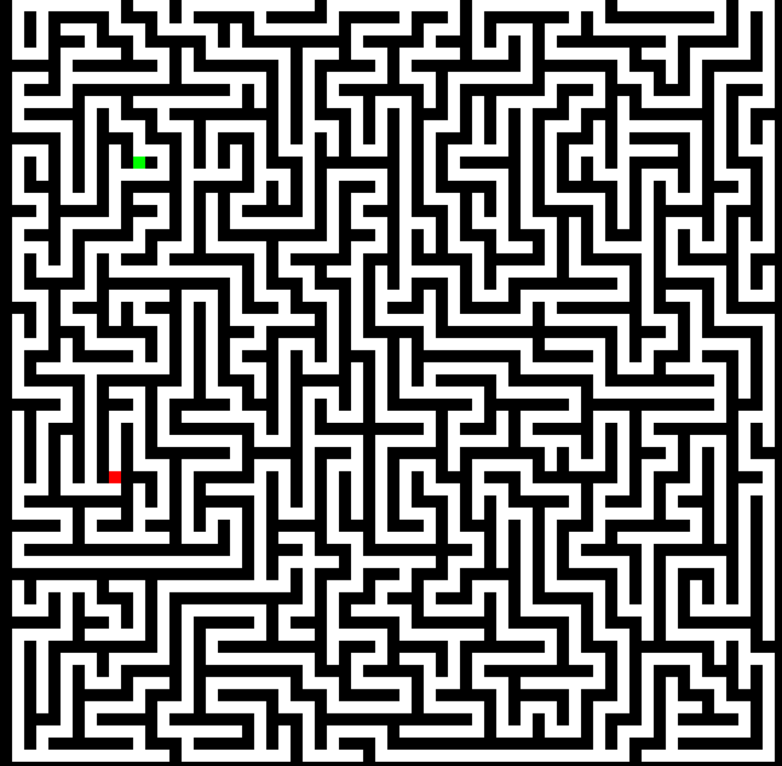
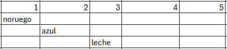
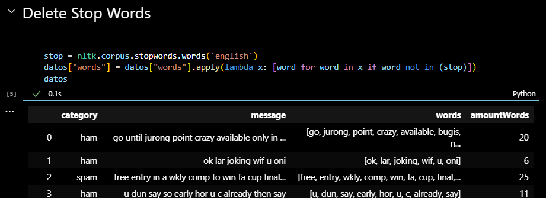
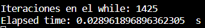
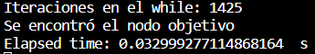
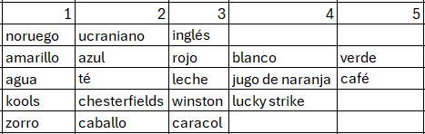
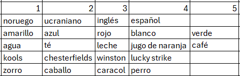
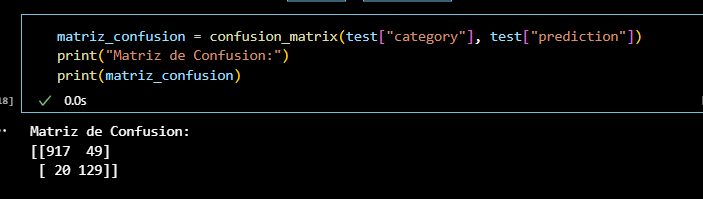

# Lab2
## Parte 1
Existen 18 diferentes posibles soluciones para este grafo. Esto se puede calcular a través de conteo o al utilizar el algoritmo para resolver grafos con constraints.
Además esta es la solución planteada:

## Parte 2
Esta sería la solución mediante el algoritmo de backtracking.

