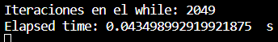
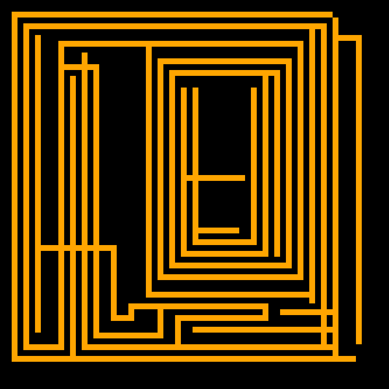
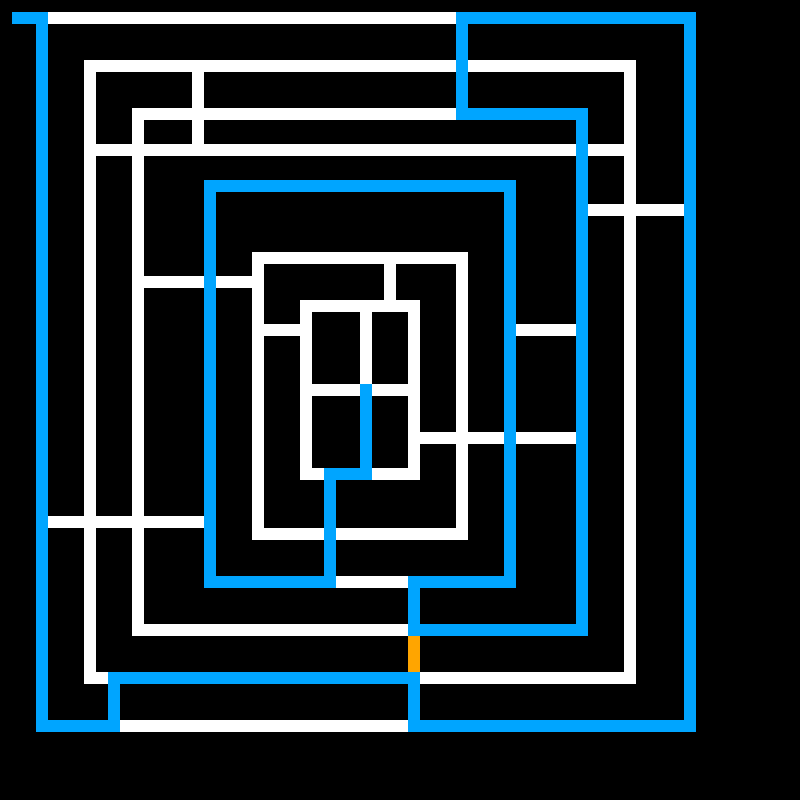
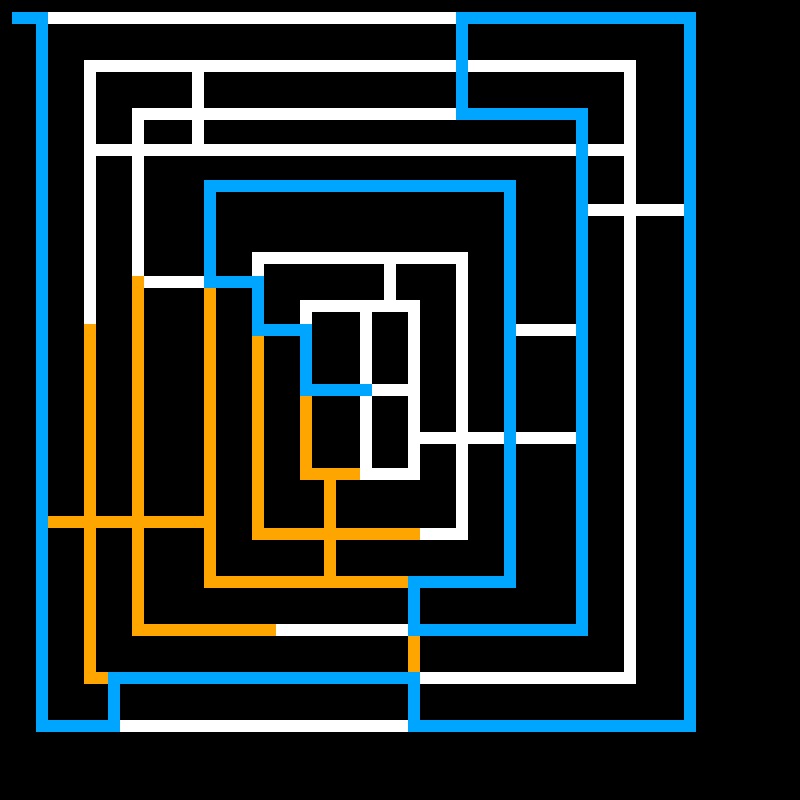
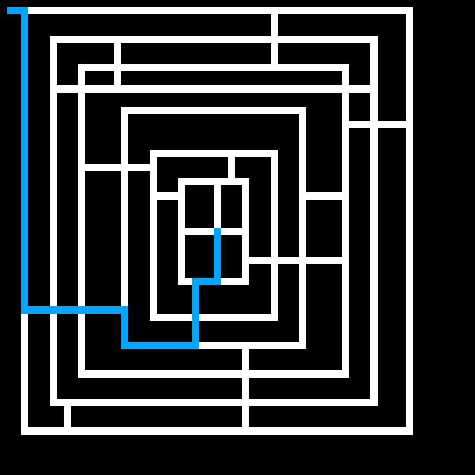
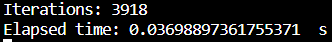

# Proyecto 1
Diego Andrés Alonzo Medinilla 20172
## ¿Qué se hizo?
Esta branch contiene el proyecto 1 de inteligencia artificial, en la cuál se realizó una implementación propia de los algoritmos de:

* Breadth First Search: que se dedica a explotar cada nivel de un árgol hasta encontrar el nodo deseado.
* Depth First Search: que se dedica a explotar una rama del árbol hasta el fondo, y encontrar el nodo en cuestión.
* Depth Delimited Search: que se diferencia del anterior algoritmo porque en vez de llegar hasta el fondo de la rama, llega hasta cierta profundidad en el árbol.
* Greedy Best First Search: que a partir de una función heurística decidirá cuál es el nodo más prometedor entre los nodos hijos del nodo actual.
* A Star Search: este algoritmo busca utilizar las ventajas de la heurística con la búsqueda de costo uniforme.

Nota: para este proyecto se utilizaron dos funciones heurísticas para resolver el laberinto, una heurística basada en la distancia euclideana y otra heurística basada en la distancia manhattan.
## ¿Qué desafíos se tuvieron?
Realmente no se tuvieron desafíos de programación realmente graves. Sin embargo, esta sería una lista con los desafíos que se enfrentaron:
* Discernir cuáles serían las mejores estructuras de datos a utilizar para almacenar los nodos, en este caso se utilizaron diccionarios. Así mismo, para las llaves en este proyecto se utilizaron las posiciones j, i dentro de la matriz dado que eran valores únicos.
* ¿Cómo se implementaría la lectura del archivo de texto para la matriz?, de manera que estaba compuesto por 0, 1, 2 y 3 pero cómo adaptaríamos esta información a los diccionarios que almacenarían los nodos. En este caso se realizaría una lectura y pues se utilizarían los i, j como llaves, así mismo, los costos para moverse entre nodos sería 1. A su vez, se ignorarían todos aquellos nodos de la matriz en la cuál fuera un 0 dado que eso significa paredes.
* Desarrollar una función comparadora para ordenar las colas de prioridad y la heurística. Esto fue, particularmente complejo dado que tenía que tomarse en cuenta cómo es que estaba programada la cola de prioridad de manera que el primer valor sería el peek mientras que el último valor sería el bottom del stack.
* Comprender y diferenciar el algoritmo de Depth First Search del Depth Delimited Search. Esto se debió realizar dado que no se comprendía sí existía diferencia alguna, cosa que sí había ya que lo que los diferenciaba era el límite, y explotar o no explotar completamente una rama.
* Implementar un modelo gráfico para desarrollar el laberinto, qué herramientas se utilizarían, se utilizarían inputs para cambiar entre algoritmos, etc. De manera que se utilizó pygame dado que es un módulo para el desarrollo de video juegos y a partir de inputs [0-9] se haría el cambio entre algoritmos, finalmente se utilizó una función para tomar screenshots del cambio en el algoritmo gráficamente.
* Si se debería de hacer algún tipo de retorno de los algoritmos de búsqueda o no, la respuesta fue que sí dado que se necesitaba el path para graficar los algoritmos en cuestión.
## ¿En qué casos es mejor para cada algoritmo?
Vamos a utilizar este laberinto generado de forma aleatoria para compararlos, cómo se observa, realmente no se encuentra tan alejado el nodo inicial del nodo final, sin embargo observaremos qué tan eficientes son los algoritmos basados en esto.

* Breadth First Search: este algoritmo mejora bastante cuándo se le provee de un nodo final, dado que para hasta el nivel en dónde se encuentre el valor y no termina de recorrer todo el árbol. 

Así mismo realiza bastantes iteraciones para recorrer por completo el árbol.

A su vez tiene una mejora sobretodo cuando los costos no son tan altos como es en el caso de el laberinto dado que moverse equivale a una unidad. Sin embargo, se debe de denotar que puede llegar a ser muy inefectivo si por azar el nodo objetivo está hasta el nivel más bajo, tal como se observa en la imagen.

A su vez, realmente porque explota todos los nodos, no se queda tan lejos en iteraciones respecto a lo que podría, tal como se observa en el número de iteraciones.

* Depth First Search: Este algoritmo explota la primera rama que encuentre, y luego va explotando hasta abajo las ramas, por lo que es eficiente aleatoriamente, de manera que puede ser muy bueno si por suerte el objetivo está en la rama que eligió.
Se debe de denotar que aunque a veces no se le brinde el nodo objetivo tiene un peor desempeño que el BFS aunque ambos exploren todos los nodos.

Sin embargo, cuando se le provee de un nodo objetivo sí tiene un mejor desempeño que el BFS. Y aunque recorre bastante porque la primera rama que explota no es la que le lleva al nodo objetivo, sí mejora sustancialmente la búsqueda.

* Depth Delimited Search: Este algoritmo es bueno cuando se le provee de un límite suficiente para encontrar el nodo que se busca. Así mismo, este algoritmo es peor cuando ocurre lo contrario, y no se le provee del suficiente límite, de manera que nunca alcanzará la solución. Por ende, este algoritmo será de lo mejor cuando los árboles sean grandes pero con una profundidad limitada, o que se tenga poco espacio por lo que se tenga que ajustar a los recursos limitados.
En este caso se tuvo la suerte de que se el dió el límite necesario para encontrar la solución, sin embargo, en otros intentos con un menor límite, de 300 por ejemplo, no le alcanzaba para recorrer casi nada de la profundidad, aunque probablemente terminara recorriendo más caminos.

* Greedy Best First Search: Este algoritmo será bueno cuando la heurística provista sea lo más informativa y provea de una buena estimación del costo restante, de manera que casi que solo es necesario basarse en la misma.
Y esto es notorio en este algoritmo, ya que a pesar de que realmente no están tan separados los nodos de inicio y final, realmente gracias a la heurística pues realizan una búsqueda mucho mayor.
Euclideana
Cómo se observa esta heurística provee el peor desempeño posible dado que realiza la mayor cantidad de iteraciones y realiza una búsqueda al principio enorme aunque después logra encontrar.

Manhattan
Básicamente se notó que las dos heurísticas describen de forma similar los caminos por lo que tienen desempeños casi iguales por no decir idénticos, y también tiene un peor desempeño cómo se observa.

Por lo que su desempeño dependerá de qué tan bueno sea la heurística describiendo el problema.
* A Star Search: Este algoritmo será escencial para resolver problemas que posean heurísticas y costos que no sean uniformes, de manera que utiliza ambos para hacer el cálculo mejor posible.
Sin embargo, en este caso el A star search utiliza la heurística Euclediana y Manhattan, que no describen correctamente el problema, por lo que termina teniendo un desempeño similar al Greedy. También es afectado dado que los costos son uniformes (1).

Tal cómo se puede observar y permite confirmar, la heurística Manhattan tiene un desempeño equivalente a la heurística Euclidiana.

Debido a que tiene estas contras para ejecutar, tanto la heurística como los costos, tiene el peor desempeño posible.

## ¿Alguno es siempre mejor que el otro?
No, no hay un algoritmo que sea siempre mejor que el otro, ya se demostró que los más pesados, es decir el A * y el Greedy que son los más complejos tuvieron el peor rendimiento dadas sus características (dependencia de una buena heurística, costos diferentes). 
Tal vez, el único que siempre sería mejor que el otro es el delimited y el first search, dado que el delimited siempre será igual o peor que el first search. Siendo en el peor de los casos que nunca encuentre el nodo objetivo dado que el límite es insuficiente.