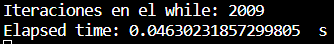
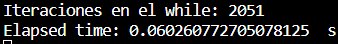
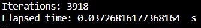

# Proyecto 2 

## Análisis Exploratorio
Para realizar el análisis exploratorio respectivo lo primero que se hizo fue tokenizar mediante la librería nltk ya que esta tokeniza palabras de una forma más inteligente.
Después se obtuvo que la proporción spam y ham es de 4825 a 747 lo que equivale a que por cada 1 texto de spam existan 6.46 textos ham.

Así mismo, se obtuvo que en promedio existen 13.81 palabras en un texto corriente de spam y 21.17 palabras en un texto de ham, sin embargo, el spam tiene poca variabilidad mientras que el ham tiene una variabilidad muy grande. Así mismo, gracias al diagrama de caja y bigotes se puede asegurar de que no habrán textos de spam que contengan más de 49 palabras.

## Limpieza de Datos
Para limpiar los datos se siguió una estructura, en primer lugar limpiar los tokens con cualquier símbolo que no sea un caracter, de manera que se filtraban de esta forma generando palabras libres de caracteres raros.

Así mismo, se eliminaron las stop words que son aquellas palabras que no brindan significancia como pueden ser artículos.

Después de esto se realizó un proceso de lematización que consiste en reducir una palabra a su forma raíz, por ejemplo, corre es un verbo que está conjugado en presente, sin embargo, correr es su forma raíz, de manera que la lematización sirve para normalizar las palabras de una forma que pueda entenderse.

Así mismo, se realizó un procedimiento de stemming de manera que reduce las palabras a su raíz, pero no de la forma en la que lo hace la lematización que las reduce de una forma léxicamente aceptada, si no que puede reducirlo a su forma más básica que incluso puede generar palabras inválidas. Es por ello que se decidió realizar primero la lematización, ya que de esta forma se podía reducir la máxima cantidad de palabras a una raíz léxicamente correcta y ya después realizar el stemming que lo llevaría a una raíz que puede o no ser válida.

Después se realizó un conteo de palabras, de manera que se contaron cuántas veces aparecía una palabra en spam y cuántas veces aparecía en spam, guardándolo en 2 diccionarios distintos, uno para spam y otro para ham. De manera que se obtuvo este top 10 palabras en spam y en ham:

Tal como se pude observar se repiten palabras en ham y en spam, de manera que existen ciertas palabras que no pueden ser tan relevantes dado qeu aparecen en ambas múltiples veces.

## Modelo

En primer lugar se dividió entre train y test el dataframe, así mismo, se calculó la probabilidad de que fuera un spam dependiendo de la frecuencia con la que aparece en textos spam o en textos ham. Después se desarrollo una función para predecir la probabilidad, la predicción de qué es sí la probabilidad es mayor a 0.5 y las palabras identificadas según un texto brindado. Así mismo, se desarrolló una prueba con el dataframe de testeo para observar cuál era la predicción, las palabras identificadas y la probabilidad de que sea spam.

## Pruebas de Rendimiento