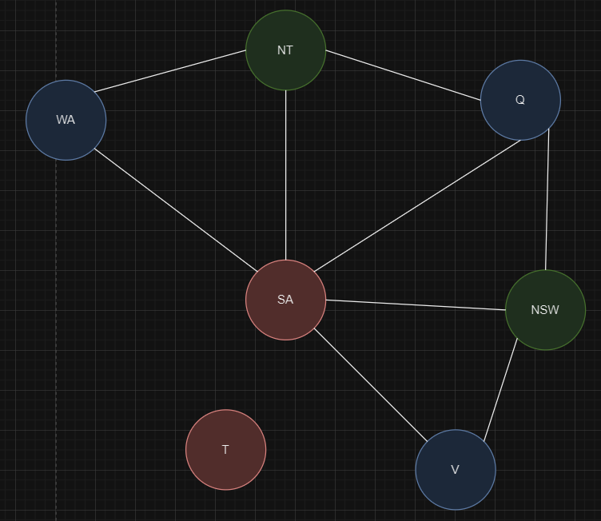
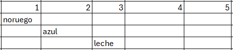
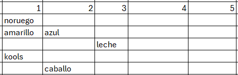
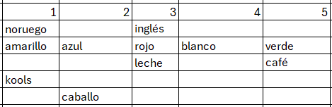
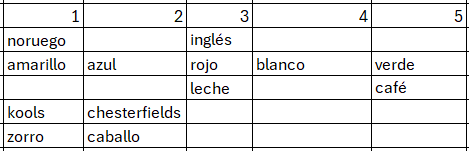
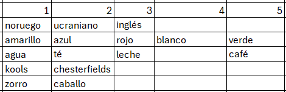
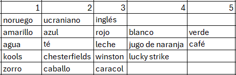
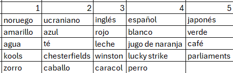
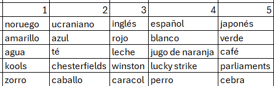

# Lab2
## Parte 1
Existen 18 diferentes posibles soluciones para este grafo. Esto se puede calcular a través de conteo o al utilizar el algoritmo para resolver grafos con constraints.
Además esta es la solución planteada:

## Parte 2
Esta sería la solución mediante el algoritmo de backtracking.

* La cebra vive en la casa 5, en la casa del japonés
* En la casa 1, la casa del noruego es dónde se toma el agua.

Una posible configuración para representar este problema como una CSP, primero que nada es mediante global constraint que se resolvería a partir de un grafo de constraints para después realizar una descomposición de árbol para generar un conjunto de subproblemas conectados. Esto sería ideal, dado que se observaron que muchas restricciones están conectadas por lo que sería ideal ir resolviendo los subproblemas que están conectados para finalmente generar la solución.
## Parte 3
Este seria el árbol

